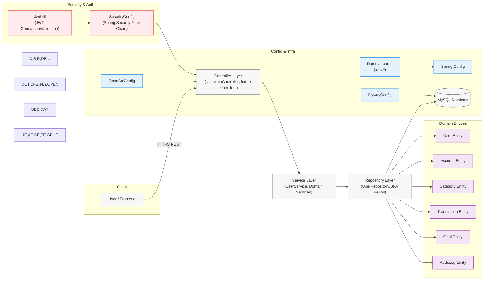
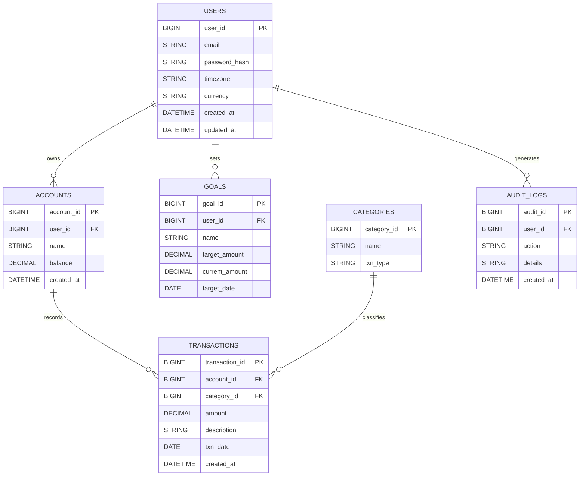
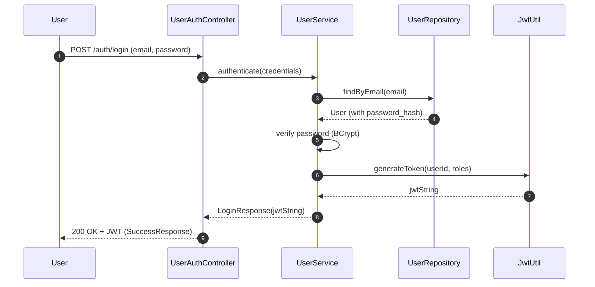
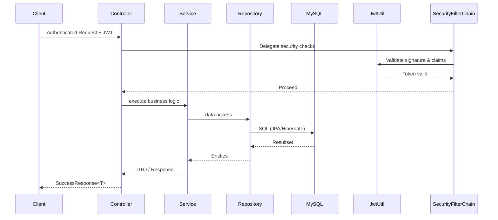
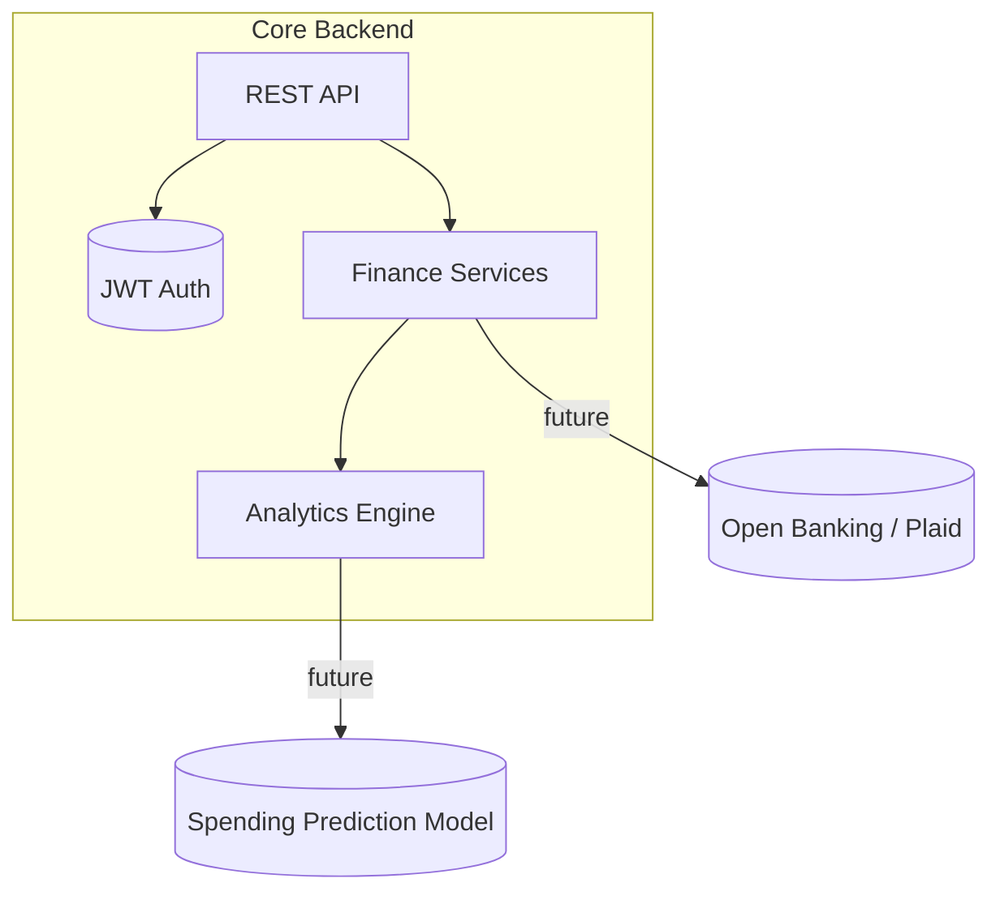

# Numina Backend Architecture (Mermaid Diagrams)

This document visualizes the Numina Personal Finance Management backend using several Mermaid diagrams: high-level component flow, entity relationships, and the authentication sequence.

## 1. Layered Component Architecture

## 2. Entity Relationship Overview

## 3. Authentication (Login) Sequence

## 4. Request Lifecycle Summary

## 5. Possible Extension View (Future Services)

---
### Notes
- Colors distinguish layers (in first diagram) for clarity.
- ER diagram approximates schema using inferred types from instructions.
- Sequence diagrams emphasize stateless JWT validation (no server session persistence).

### Next Ideas
- Add a deployment diagram (Docker Compose + external MySQL + future caching).
- Add performance/monitoring view (Actuator + metrics + logs pipeline).

Feel free to request variations (e.g., dark theme, simplified view, or deployment focus).
